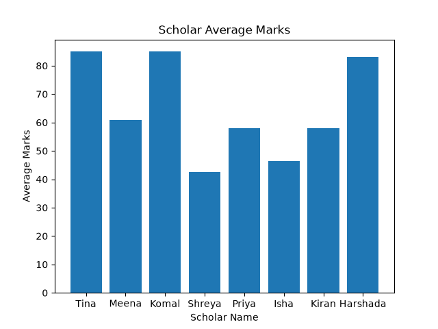

# Scholar Performance Analysis

## Project Overview
This project analysis Scholar performance using python and a csv dataset.

## Objective
-Calculate Scholar's average marks
-Find the highest and lowest average
-Identify the top-performing scholar
-Visualize the results using a bar chart

## Tool Used
-PYTHON
-PANDAS
-MATPLOTLIB
-CSV

## Project Files
-'Analysis.py'- Python analysis program
-'scholar_data.csv'-Sholar dataset
-'scholar_average_marks.pns'-Average marks Visualization

## Key Result
The project identifies the Scholar with the highest average marks and compares the performance of all scholar
using a bar chart.

## What I Learned
-Reading CSV files with pandas
-Performing data calculations
-Finding Maximum and Minimum values
-Creating Visualizations with Matplotlib
-Presenting a data analysis project

## Visualization.

